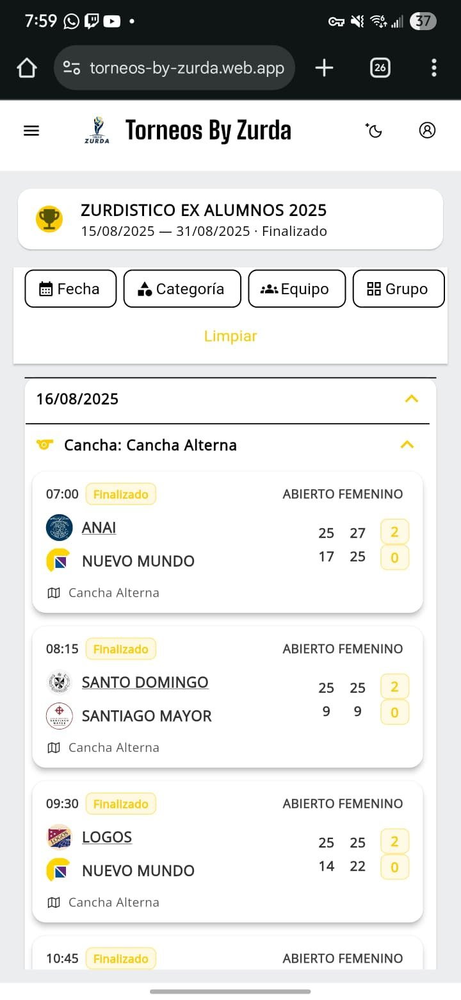
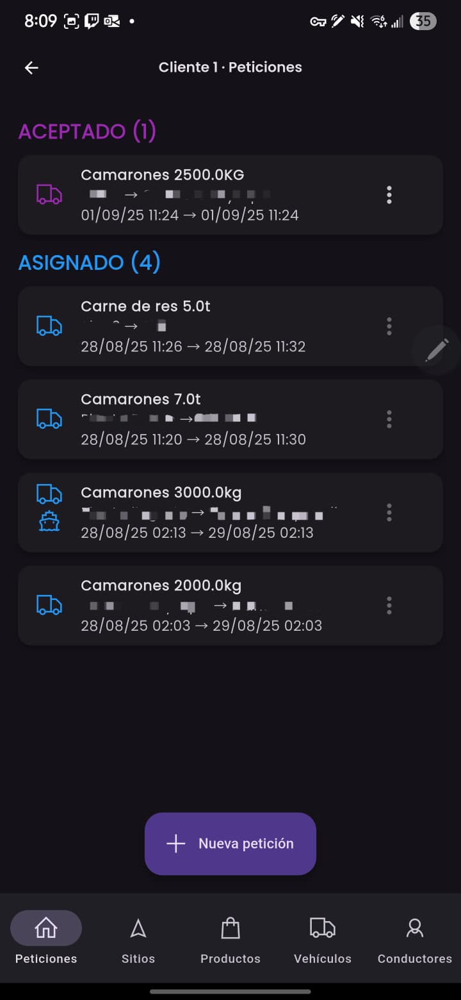
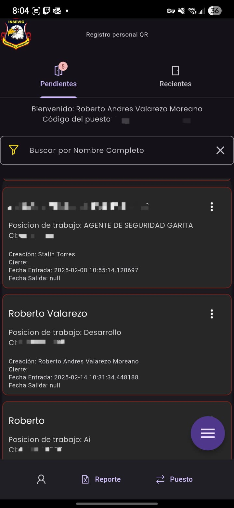
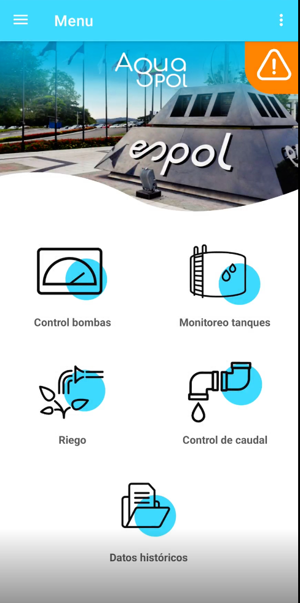
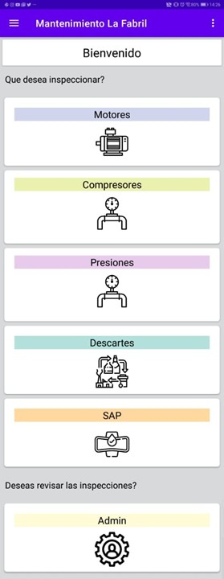

# 🚀 Roberto Valarezo – Project Portfolio

Welcome to my project portfolio!  
Here you will find a selection of applications I’ve developed or contributed to, showcasing my experience in *Artificial Intelligence, Computer Vision, Web and Mobile Development, Mechatronics and Data Engineering*.

## 🌎 About Me
I’m a *Mid-level AI Engineer* with experience building *computer vision solutions, web/mobile apps, and data pipelines*.  
Currently studying *Data Engineering & Analytics* while working on AI and full-stack projects. 

## 🔗 Web Portfolio
[Web Portfolio](https://rvalarezo.github.io/portfolio/)

---

## 📱 Applications

### 1. Torneos By Zurda (2025)  
🔗 [Live App](https://torneos-by-zurda.web.app/)  

*Description:*  
A platform for managing volleyball tournaments with *live scoreboards, player statistics, ranking tables, and live streaming* – all in *real time*.  

*Technologies:*    
*My Role:* Full-stack developer  

*Key Features:*  
•⁠  ⁠Real-time scoreboard updates  
•⁠  ⁠Player and team statistics  
•⁠  ⁠Tournament ranking tables  
•⁠  ⁠Live streaming support  

---

### 2. Insevig Custody (2024)  

*Description:*  
Internal app for a custody & security company, allowing clients to request custody services for goods (land or maritime). Tracks every custody step from arrival to final delivery.  

*Technologies:*    
*My Role:* Lead developer  

*Key Features:*  
•⁠  ⁠Create and track custody requests  
•⁠  ⁠Multi-modal transport (land, maritime)  
•⁠  ⁠Vehicle and resource assignment  
•⁠  ⁠Step-by-step custody logging  

---

### 3. Insevig Logs (2024)  

*Description:*  
Customizable *digital security logbooks* to replace paper records, assigned to security posts for tracking activities (e.g., vehicle/driver registration at plants).  

*Technologies:*    
*My Role:* Full-stack developer  

---

### 4. CIR Forms (2023)  

*Description:*  
Survey collection app for the *Centro de Investigaciones Rurales. Supports **real-time surveys* and *offline-first mode* for rural data gathering (e.g., drought impact on farmers).  

*Technologies:*    
*My Role:* Full-stack developer  

---

### 5. Agua Pol (2022)  

*Description:*  
IoT-enabled Android app to monitor campus *water reservoirs* using Zigbee sensors. Generates real-time alerts when levels drop below thresholds.  

*Technologies:*     
*My Role:* IoT & Android developer  

---

### 6. La Fabril Reports (2021)  

*Description:*  
First professional project as an intern. Replaced manual paper logs for machine parameters with a *real-time digital reporting system* integrated with MySQL.  

*Technologies:*    
*My Role:* Junior developer  

---

## 📊 Skills Highlight
  
  
  
  
  
  
  

---

